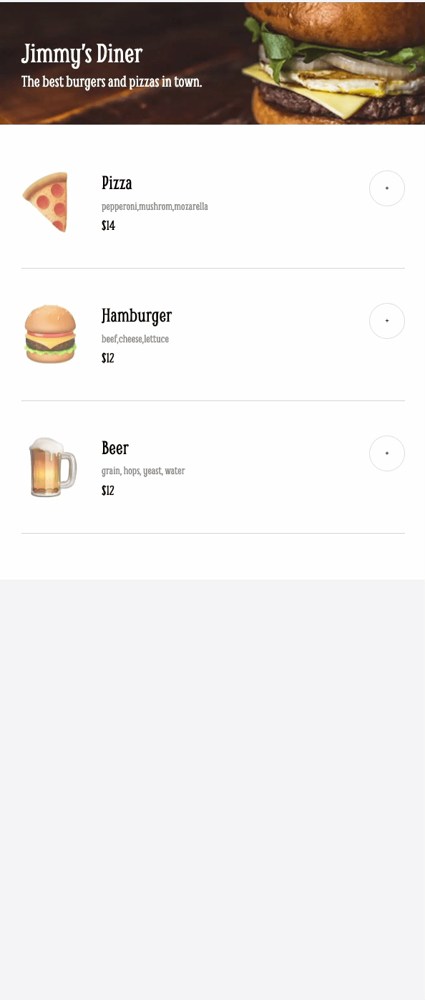

# Restaurant Ordering App


[](https://app.netlify.com/projects/papaya-arithmetic-b2b65b/deploys)

A modern, responsive web application for restaurant menu browsing and order placement. Built with TypeScript and Vite.

---

## Table of Contents

- [Features](#features)
- [Demo](#-demo)
- [Screenshots](#screenshots)
- [Getting Started](#getting-started)
  - [Prerequisites](#prerequisites)
  - [Installation](#installation)
  - [Running Locally](#running-locally)
- [Project Structure](#project-structure)
- [Usage](#usage)
- [Contributing](#contributing)
- [License](#license)
- [Acknowledgements](#acknowledgements)

---

## Features

- 📋 Interactive menu with images and prices
- 🛒 Add/remove items to/from your order
- 💳 Modal-based checkout with form validation
- 🎨 Responsive and modern UI
- ⚡️ Built with TypeScript and Vite for fast development

---

## Screenshots



## Demo

Check out the live demo [here](https://restaurant.kevinngongang.dev).

## Getting Started

### Prerequisites

- [Node.js](https://nodejs.org/) (v18 or higher recommended)
- [npm](https://www.npmjs.com/) or [yarn](https://yarnpkg.com/)

### Installation

Clone the repository:

```bash
git clone https://github.com/bakadja/restaurant-ordering-app.git
cd restaurant-ordering-app
```

Install dependencies:

```bash
npm install
# or
yarn install
```

### Running Locally

Start the development server:

```bash
npm run dev
# or
yarn dev
```

Open [http://localhost:5173](http://localhost:5173) in your browser to view the app.

---

## Project Structure

```
restaurant-ordering-app/
├── public/
├── src/
│   ├── assets/
│   ├── data.ts
│   ├── main.ts
│   ├── style.css
│   └── vite-env.d.ts
├── index.html
├── package.json
├── tsconfig.json
└── README.md
```

---

## Usage

- Browse the menu and add items to your order.
- Click "Complete order" to open the payment modal.
- Enter your details and submit to complete your order.

---

## Contributing

Contributions are welcome! Please open issues and submit pull requests for improvements or bug fixes.

1. Fork the repository
2. Create your feature branch (`git checkout -b feature/YourFeature`)
3. Commit your changes (`git commit -am 'Add new feature'`)
4. Push to the branch (`git push origin feature/YourFeature`)
5. Open a pull request

---

## License

This project is licensed under the [MIT License](LICENSE).

---

## Acknowledgements

- [Vite](https://vitejs.dev/)
- [TypeScript](https://www.typescriptlang.org/)
- [Google Fonts - Smythe](https://fonts.google.com/specimen/Smythe)
- [Figma Community - Ferks Guare](https://www.figma.com/community/file/1169028343875283464)

---
